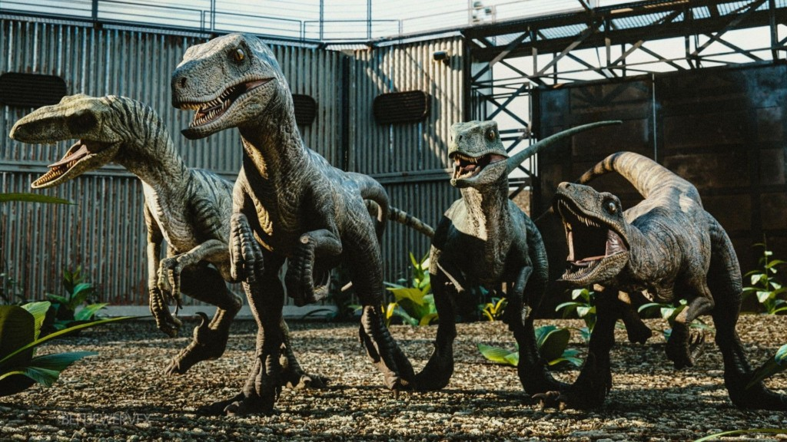

<!--
_class: lead invert
-->

# **ジュラシック・パーク**に出てくる**恐竜**

---

# **ジュラシック・パーク**シリーズ

- 『ジュラシック・パーク』（1993）
- 『ロスト・ワールド／ジュラシック・パーク』（1997）
- 『ジュラシック・パーク III』（2001）
- 『ジュラシック・ワールド』（2015）
- 『ジュラシック・ワールド 炎の王国』（2018）
- 『ジュラシック・ワールド／ドミニオン』（2021予定）

---

# １年前の**日向坂で会いましょう**にて

  

**こさかな**が紹介した**ジュラシック・パーク**に
出てくる恐竜の紹介をしていきます！

---

---

---

---

# **ブラキオサウルス**

---

# **ブラキオサウルス**

ジュラシックパークで一番はじめに登場した恐竜

ジュラ紀後期のアメリカ大陸に生息していた大型草食恐竜で、当時腐るほどいた竜脚類の一種である。

最大の特徴はその巨大さで、体長はおよそ25メートル、重さは最低でも23t、最大の個体はなんと50tにもなると言われている超オリンピック級の恐竜であった。

---

# **ヴェロキラプトル**

---

# **ヴェロキラプトル**

白亜紀後期のアジア大陸に生息していた小型の肉食恐竜で、主にモンゴルにて化石が発掘されている。

言わずと知れたシリーズの顔役であり、この恐竜がいなければジュラシック・パークは成り立たないと言えるほど、作品において重要なウェイトを占めているトップスター恐竜の一種でもある。

---

# **スピノサウルス**

---

# **スピノサウルス**

最近では2018年に尻尾の化石が初めて発掘され、それを入念に調べたところモササウルスに匹敵するほどの太ましい尾となっていたことが分かり、普段から水中を泳ぎ回っていた可能性が高まった。

---

# **モササウルス**

---

# **モササウルス**

 

白亜紀後期に生息していた大型水性爬虫類で、あらゆる世界の大海を統べる絶対的な王であった。
それを裏付けるように世界各国の地層からモササウルスの化石はわんさか見つかっており、なんと日本でも発見例がある。

---

# **インドミナス・レックス**

---

# **インドミナス・レックス**

- ティラノサウルスをも上回る巨大な体躯
- 硬質で特徴的な頭と鋭い角。
- 頭から背中に掛けて生える鋭い棘に獰猛な瞳。
- ヴェロキラプトルに匹敵する高い知能。
- 走る速度は時速48km
- カモフラージュ能力でカメレオンのように周囲の環境に合わせて体の色を変えられる。
- 赤外線放射抑制能力によって、センサーを潜り抜けることが可能。

---

# **ティラノサウルス・レックス**

---

# **ティラノサウルス・レックス**

白亜紀後期の北アメリカに生息していた大型肉食恐竜で、その体長は平均11メートル、最大で13メートルの個体もいた。 当時の環境において陸上最大級の捕食者であったとされており、現在においてもティラノサウルス以上の巨体を持つ肉食獣は存在していない。

発掘された化石を分析したところ、ティラノサウルスは最大で６トンもの咬合力を発揮できたとされており、これは自動車をスクラップにできるほどのパワーである。

---

<!--
_class: lead invert
-->

# Thank **You** for Reading :smiley:
